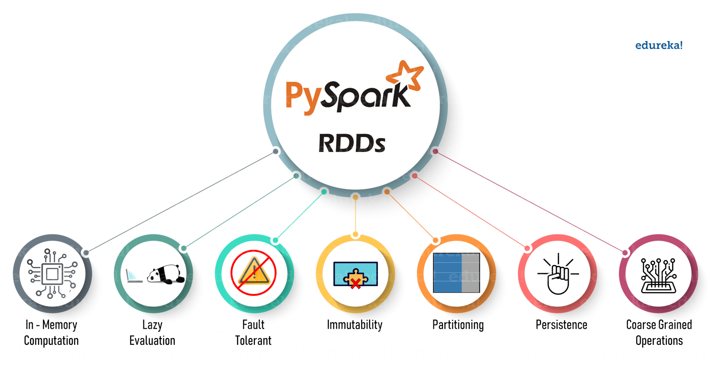

# Pipeline_Spark
Tutorial do Python Spark

Preparando o ambiente de desenvolvimento do ambiente Python

Instalação do ambiente de desenvolvimento: instale o Anaconda e o PyCharm CE

Outros ambientes recomendados: Eclipse, Spyder (incluído no anaconda e Aton)

Configurar e alterar o ambiente python virtuallogo

Pacotes de importação: pip install & import

Crie um diretório se ele não existir: os.start (...) os.mkdir (...)

Ambiente virtual para Python -m venv environment_name

Ambiente Spark Python

Instalação do Apacke Spark

Usando o Apache Spack online: databricks community edition

Bibliotecas regulares

Instalação do Apache Spark com distribuição gratuita (Hortonworks)

Conceitos básicos
Funções
Funções com Spark
Loops: por enquanto
Inclua argumentos: discuta. Exemplo: copy.py source_file.txt destination_file.txt
Datas
 

Carregar e ler arquivos
Lendo e gravando arquivos: csv, facta
Carregar e ler CVS nos Databricks - Spark
Leia e escreva até tablets JSON
Ler e escrever até Parquet tablets
 

Estruturas de dados
DATAFRAMES (simples)
DataFrames: importe pandas como pd data = pd.DataFrame (colunas = ('dados1', 'dados2'))
MATRICES (simples)
Matrizes: import numpy como np data = np.array ([[1,2,3], [4,5,6]])
LISTAS (simples)
Listas: list (), [1,2,3], anexar (), estender (), remover (), contar (), índice (), conjunto ()
RDD (Spark)
Criação de RDD
RDD de coletas de dados
RDD de dicionários
RDD da leitura de arquivos
Armazenamento RDD
RDD gravando no arquivo
Operações RDD
Operações básicas com uma lista RDD
Operações básicas com um dicionário RDD
Classificar RDDs
Filtragem RDD
Amostragem de dados
Operações com conjuntos
Mapear / Reduzir operações

 

Processamento de dados
Processamento de dados em lote
Definir um DataFrame «pyspark«
Executar agrupamentos de dados
Executar consultas SQL
Processamento em tempo real (streaming)
Preparação de dados que simulam tempo real
Executar agrupamentos de dados
Definir configurações de fluxo de dados do cluster
Executar consultas SQL
 

Tubos (Tubulações)
Uso de tubulações (Tubulações)
Uso de tubos em árvores de decisão
Uso de tubos em k-means
 

Aprendizado de máquina
Aprendizado supervisionado
Árvores de decisão (simples) - Spark
Regressão linear simples
Regressão linear simples - Spark
Regressão logística
Aprendizagem não supervisionada
K-Means - Centelha

Execução distribuída no Spark
Olá, exemplo mundial

Outros
Testes unitários
Bioinformática: Segmentador de Sequências Nucleotídicas
